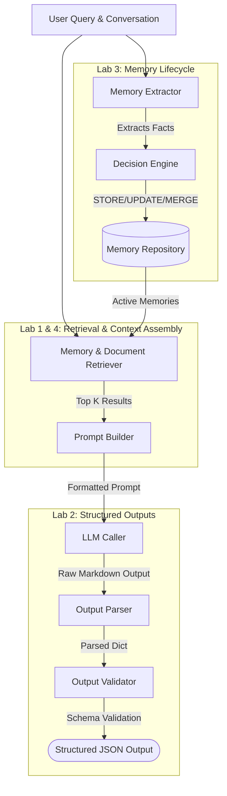

# ChunkdUp

(Yes, I named it ChunkdUp purely because it sounded cool in my head. There is no deeper meaning. Don't look for one.)

I'm building this from scratch because I actually want to understand how a machine remembers, rather than just pretending I do by calling an API.

We throw around buzzwords like "AI agents" and "RAG pipelines" at parties to sound smart, but under the hood, we're really just wrestling with the same core problems that have bothered computer scientists for decades:

- *How do you shove the most useful information into a strictly limited space (a context window) without breaking things?*

- *How do you force an inherently probabilistic, hallucination-prone system to return safe, structured data instead of philosophical ramblings?*

- *When a machine learns a new fact that contradicts an old fact, how does it decide whether to update, ignore, or just awkwardly hoard it?*

I don't want to just `pip install` a magical framework that sweeps these problems under the rug. I want to solve them manually, painfully, and step-by-step.

## The Journey So Far (The Messy Labs)

Here is what I've figured out so far while banging my head against the keyboard:

- **[Lab 001: The Constraint Problem](learnings/lab001/leanings_001.md)**
  How do we decide what text makes the cut when we have a strict character budget? (Spoiler: exact keyword matching is garbage. Semantic similarity and greedy budget packing is where it's at).

- **[Lab 002: The Trust Problem](learnings/lab002/learnings_002.md)**
  How do we safely consume output from a machine that makes things up for fun? (Explored strict JSON validation, regex fallback parsing, and the art of intentional rejection).

- **[Lab 003: The State Problem](learnings/lab003/lab3_complete_overview.md)**
  How does a system gracefully evolve its memory over time without duplicating everything like a digital hoarder? (We built a deterministic policy-driven orchestration engine to resolve state conflicts and a composite memory ranker).

- **[Lab 004: The Semantic Memory Pipeline](learnings/lab004/learnings_004.md)**
  How do we transition from a static memory database to a fully memory-aware assistant? (We connected the entire system—retrieving dynamic user state, formatting it as a prompt, and generating structured JSON outputs while preventing hallucinations).

## The Final Architecture

By stacking these labs instead of replacing them, we evolved from simple isolated experiments into a cohesive, production-ready pipeline. Here is the final architecture we built from scratch:

## What's Next?

This chapter of ChunkdUp is complete! We have successfully built a modular, deterministic, memory-aware infrastructure pipeline from the ground up without relying on black-box frameworks. 

We will be moving forward toward new horizons and different learnings. Keep building!
