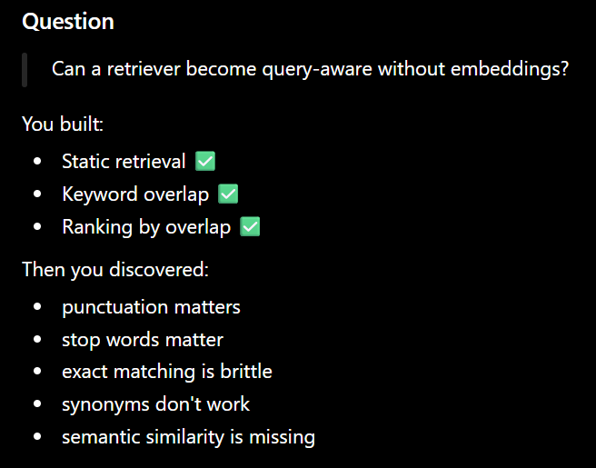

# Lab 001 - Context Assembly

## Engineering Question

Given retrieved chunks, how should an AI system decide what reaches the LLM?

## Today's Goal

Understand the structure of retrieved chunks before implementing any context assembly logic.

## Hypothesis

A context assembler should operate only on retrieved chunks.
It should not care how they were retrieved.

## Status

✅ Retrieved chunks successfully loaded and inspected.

Question:

Given retrieved chunks...

How should the system choose context?

Answer:

Policy V1

↓

Take Top-3 by score.

"it goes to the retrieval methods then from there, we go to _calculate the overlap based on that, we return the overlapped chunk and then on the basis of that we return the scored chunks and then return the top chunks"

It goes to retrieve()
For every chunk, it calculates overlap using _calculate_overlap()
It stores (overlap, score, chunk) in a list called scored_chunks
It sorts this list (best first)
Finally, it returns only the top k chunks

Finding: Simple keyword overlap is highly sensitive to punctuation, stop words, and exact vocabulary matches. It is useful for demonstrating the retrieval pipeline but is not robust enough for semantic retrieval.

# Result

Replacing keyword matching with semantic retrieval significantly improved the relevance of retrieved chunks.

# Decision

Adopt semantic retrieval as the default retrieval strategy for the AI system.

# Next Question

Given relevant chunks, how should the Context Assembler decide which ones reach the LLM?

The engineering lesson

Retrieval answers:
"What is relevant?"

Budget-aware assembly answers:
"What can I afford to send?"

---

## Experiment 2: Budget-Aware Selection
A relevant chunk is not guaranteed to reach the model; it must compete for the available context budget.

Greedily add the highest-ranked chunks until the budget is exhausted.

#new updates :
- i have created two prompts i.e. one basic and one expert prompt
- the difference is that ,two of the prompts which will be orchestrated using the retrieved context chunks
- these chunks will be monitored overally evaluated by a seperate LLM for a fair judgement
